<div align="center">

# Neuromorphic Optical Tracking and Imaging of Randomly Moving Targets through Dynamic Dense Scattering Media

**[Ning Zhang](mailto:ning_zhang1@brown.edu)<sup>★</sup> &nbsp;&middot;&nbsp; [Arto Nurmikko](mailto:arto_nurmikko@brown.edu)<sup>★</sup>**

School of Engineering, Brown University, Providence, RI, USA
<br><sup>★</sup> Corresponding authors

[]()
[](code/)
[](datasets/)
[](videos/)
[](LICENSE)

<p align="center">
  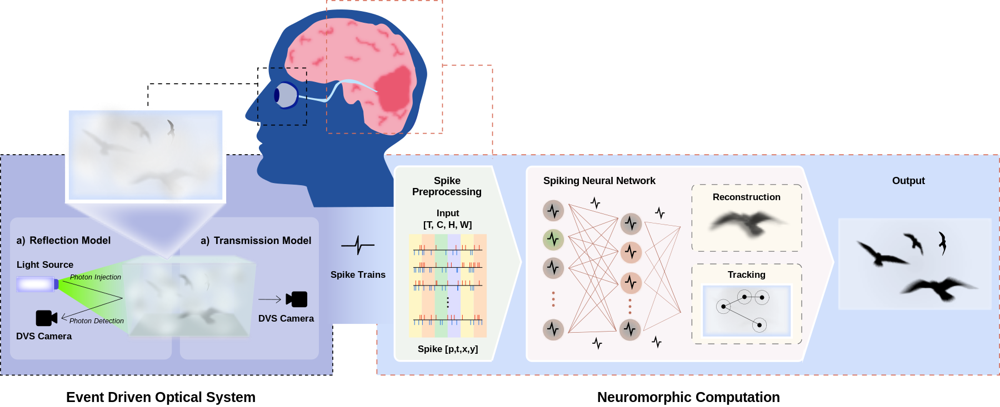
</p>

<p align="center"><i>An end-to-end, fully spike-based pipeline: a dynamic vision sensor (the "retina") suppresses the static scattering background and emits sparse spike trains; a custom deep spiking neural network (the "visual cortex") tracks and reconstructs the hidden moving target in parallel.</i></p>

</div>

---

## TL;DR

We present, to our knowledge, the **first end-to-end neuromorphic system that simultaneously tracks and reconstructs randomly moving targets hidden inside dense scattering media** — solid phantoms, turbid water, and dynamic fog. A **dynamic vision sensor (DVS)** naturally suppresses the static "foggy" background and feeds sparse spike trains directly into a **deep spiking neural network (SNN)** that performs localization and image recovery together. The system reaches **SSIM up to 0.96**, runs a full sequence in **< 15 ms**, and is estimated to use **~20× less energy** than an equivalent artificial neural network.

> [!NOTE]
> This manuscript is currently **under review**. To respect the review process, source code, datasets, and trained models will be released **after final publication** (see the [release checklist](#-release-checklist) below). The four supplementary videos are available now under [`videos/`](videos/).

---

## 📰 Release checklist

- [x] Project repository and documentation
- [x] Supplementary demonstration videos (M1–M4)
- [x] Key figures from the manuscript
- [ ] Source code — *available after final publication*
- [ ] Datasets (MNIST / KMNIST / Birds event recordings) — *available after final publication*
- [ ] Pre-trained model weights — *available after final publication*
- [ ] Step-by-step training & inference instructions — *available after final publication*

---

## Abstract

Imaging and tracking objects moving along random, unpredictable trajectories through dense scattering media remains an open challenge with direct applications in autonomous navigation, underwater robotics, and biomedical sensing. Here we present, to our knowledge, the first end-to-end brain-inspired neuromorphic system that accomplishes both tasks simultaneously. A dynamic vision sensor (DVS) captures photons interacting with dynamic targets while suppressing the static "foggy" scattering background, yielding sparse spike trains. These feed directly into a deep spiking neural network (SNN) with dual modules: an **Object Tracking Module** for real-time localization and an **Object Reconstruction Module** with residual refinement for high-fidelity spatial recovery. Temporal memory in leaky integrate-and-fire neurons lets the network accumulate evidence across time steps, reconstructing consistent target geometry despite substantial motion-induced variation in spike patterns. We validate the system in transmission and reflection geometries using solid optical phantoms, turbid water, and dynamic fog, with targets of increasing complexity — MNIST digits, Kanji characters, and birds executing naturalistic trajectories. The system achieves structural similarity indices up to **0.96** and mean squared errors as low as **0.004**, with full-sequence inference completing in under **15 ms**. Energy analysis indicates approximately **20-fold** reductions relative to equivalent artificial neural networks, positioning the approach for emerging ultralow-power neuromorphic hardware.

---

## ✨ Key contributions

1. **Temporal contrast for imaging in turbid media.** By capturing only temporal intensity changes, the event sensor suppresses the static scattering background, enabling tracking and reconstruction of randomly moving targets through dense turbid media.
2. **A modular SNN for joint tracking and reconstruction.** A spiking network with parallel object-tracking and image-reconstruction modules processes everything as spikes in a single asynchronous event stream, exploiting sparse, event-driven computation and the intrinsic membrane-potential memory of spiking neurons to achieve low latency (**< 15 ms**) and low power (**~20× less than an ANN** on a standard GPU).
3. **Validation across diverse scattering environments.** Across reflection and transmission geometries — solid phantoms, turbid water, and dynamic fog — the system delivers high-fidelity reconstruction (**SSIM 0.81–0.96**) with accurate trajectory recovery.

---
<!--
## 🧠 Method

The pipeline is fully neuromorphic end to end. Raw, asynchronous DVS events `[p, t, x, y]` are discretized into spike tensors `[T, C, H, W]` and routed simultaneously to two task branches built from **leaky integrate-and-fire (LIF)** neurons with stateful synapse filters that retain short-term temporal memory:

- **Object Tracking Module (OTM)** — a compact downsampling SNN encoder followed by a shallow fully-connected spiking head that maps latent features to target coordinates `(x, y)`. Only the final spiking layer resets at each time step, so the tracker localizes the target before reconstruction has fully converged.
- **Object Reconstruction Module (ORM)** — a spiking U-Net-like encoder–decoder with skip connections that recovers spatial detail.
- **Residual Refinement Module (RRM)** — a smaller spiking encoder–decoder that learns a residual correction on top of the ORM output to sharpen fine structure.

The two task branches are trained separately with their own losses (no cross-module backpropagation) and fused at inference to process the same input stream in parallel.

<p align="center">
  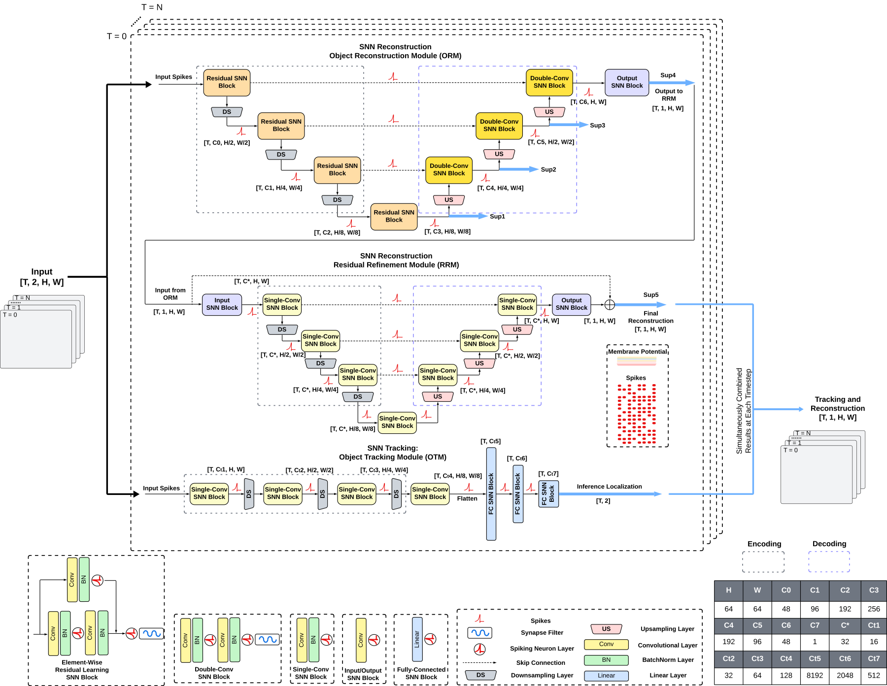
</p>
<p align="center"><i>SNN architecture: parallel Object Reconstruction (ORM), Residual Refinement (RRM), and Object Tracking (OTM) modules operating on a shared event stream.</i></p>
-->
---

## 🔬 Experimental setup

Benchtop experiments used **reflection** and **transmission** geometries. Scattering strength is quantified by the measured **optical thickness (OT)** rather than an unquantified diffuser, with photon mean free path (MFP) estimates reported in the supplement. Events are recorded with a **Prophesee Gen 3.0 EVK DVS** (640 × 480 px, 9.6 × 7.2 mm² active area); a frame-based CMOS camera is used only as an alignment reference.

<p align="center">
  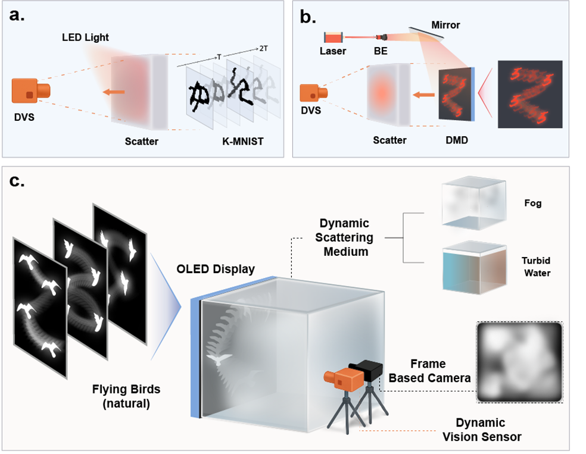
</p>

| # | Target | Medium | Geometry | Motion | Optical thickness |
|:-:|:--|:--|:--|:--|:--|
| i | Kanji (KMNIST) characters | Solid silicone–SiO₂ phantom | Reflection (double-pass) | Static, time-varying contrast | **OT ≈ 6.6** (~144 MFP) |
| ii | MNIST digits | Solid silicone–SiO₂ phantom | Transmission | Random piecewise (Brownian) | **OT ≈ 3.3** |
| iii | Bird silhouettes | Turbid water (diluted intralipid, 30 cm³ tank) | Transmission | Naturalistic flight | **OT ≈ 3.5** |
| iv | Moving targets | Dynamic fog chamber | Transmission | Random | **Fluctuating OT** |

---

## 📊 Results

<div align="center">

| Metric | Result |
|:--|:--|
| Reconstruction quality (SSIM) | **0.81 – 0.96** |
| Reconstruction error (MSE) | **as low as 0.004** |
| Full-sequence inference (18 steps) | **< 15 ms** |
| Estimated energy vs. equivalent ANN | **~20× lower** |
| DVS front-end power | **~28 mW** (>10 kHz effective frame rate) |
| Largest demonstrated optical thickness | **OT ≈ 6.6** (~144 photon MFP) |

</div>

**Moving MNIST digit through a solid phantom (transmission).** The tracker locks onto the target early, and reconstruction sharpens as the LIF neurons accumulate temporal evidence across time steps `T₁ → T₁₈`.

<p align="center">
  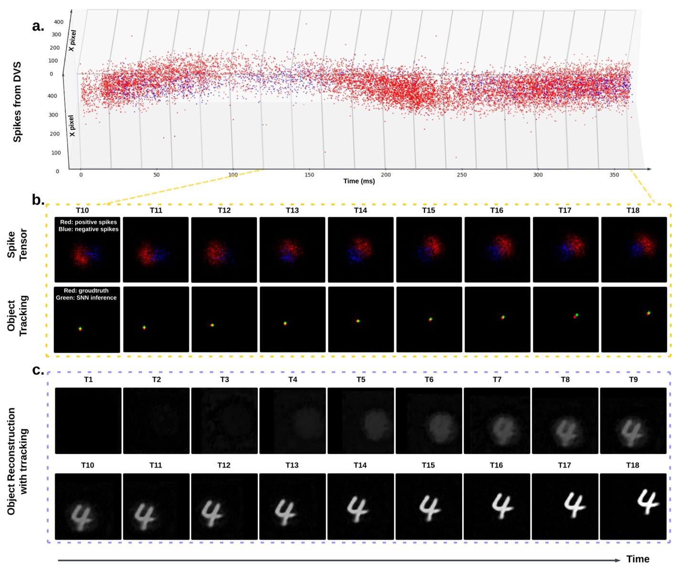
</p>

**Consistency across the full test set.** Sixty-four randomly selected digits, each following a distinct random trajectory: accumulated spike tensor (left), ground truth (center), and final reconstruction (right).

<p align="center">
  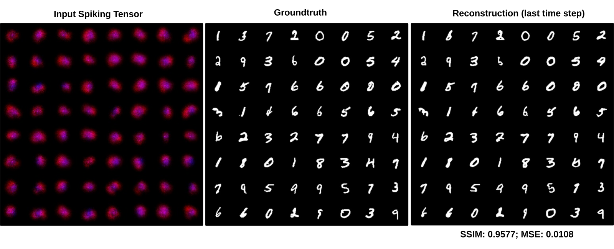
</p>

**Higher-complexity targets in turbid water and dynamic fog.** Bird silhouettes on naturalistic trajectories, with t-SNE structure of the datasets and reconstructed outputs.

<p align="center">
  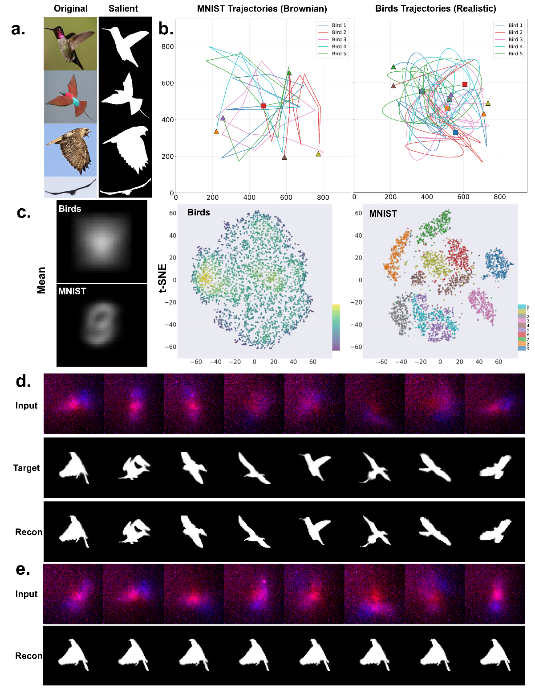
</p>

**Reflection-geometry, time-varying Kanji characters.**

<p align="center">
  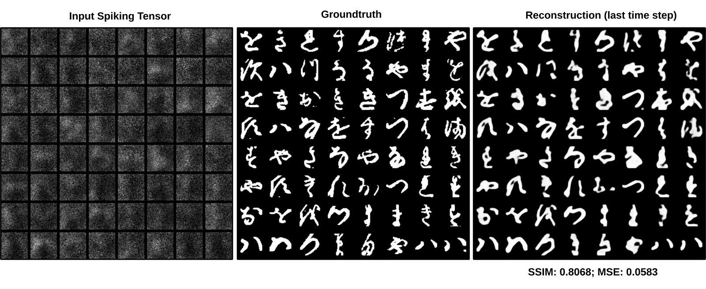
</p>

---

## 🎬 Supplementary videos

The four supplementary videos are included in this repository under [`videos/`](videos/). Click a thumbnail to open the corresponding video.

<table>
  <tr>
    <td align="center" width="50%">
      <a href="videos/M1_MNIST.mp4">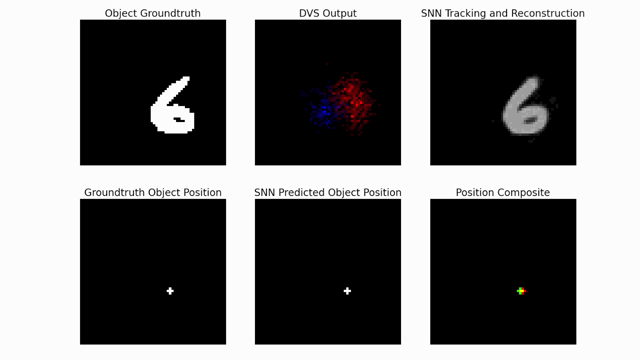</a>
      <br/><b>M1 — Moving MNIST digit</b><br/>Solid phantom, transmission. Per-step tracking + reconstruction.
    </td>
    <td align="center" width="50%">
      <a href="videos/M2_KMNIST.mp4">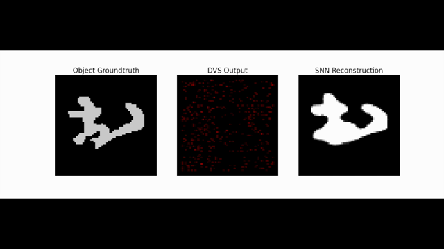</a>
      <br/><b>M2 — Kanji (KMNIST) characters</b><br/>Solid phantom, reflection, time-varying contrast.
    </td>
  </tr>
  <tr>
    <td align="center" width="50%">
      <a href="videos/M3_Birds.mp4">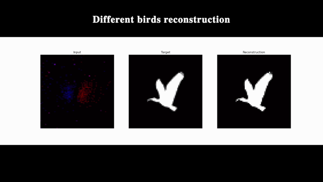</a>
      <br/><b>M3 — Birds on naturalistic trajectories</b><br/>Turbid water, transmission.
    </td>
    <td align="center" width="50%">
      <a href="videos/M4_Fog_Chamber.mp4">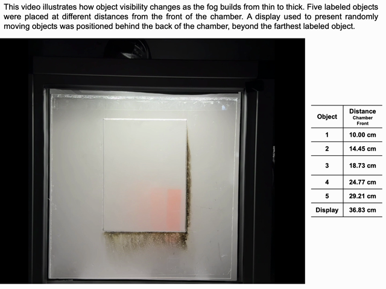</a>
      <br/><b>M4 — Dynamic fog chamber</b><br/>Object visibility vs. fog density at varying distances.
    </td>
  </tr>
</table>

> Videos are stored with **Git LFS**. See [`videos/README.md`](videos/README.md) for details.

---

## 📁 Repository structure

```
neuromorphic-imaging/
├── README.md                 # This file
├── LICENSE                   # All rights reserved (until publication)
├── CITATION.cff              # How to cite this work
├── assets/                   # Figures used in this README
│   ├── fig1_concept.png
│   ├── fig2_optical_setup.png
│   ├── fig3_architecture.png
│   ├── fig4_kanji_reflection.png
│   ├── fig5_mnist_tracking.png
│   ├── fig6_testset.png
│   ├── fig7_birds_fog_water.png
│   ├── graphical_abstract.png
│   └── thumbs/               # Video preview thumbnails
├── code/                     # Source code (released after publication)
│   └── README.md
├── datasets/                 # Datasets (released after publication)
│   └── README.md
└── videos/                   # Supplementary videos M1–M4 (Git LFS)
    ├── M1_MNIST.mp4
    ├── M2_KMNIST.mp4
    ├── M3_Birds.mp4
    ├── M4_Fog_Chamber.mp4
    └── README.md
```

---

## ⚙️ Getting started

> [!IMPORTANT]
> Source code is **not yet released**. It will be made available in [`code/`](code/) after the manuscript is published. Training and inference instructions, environment specifications, and pre-trained weights will accompany that release. The model was trained on a single **NVIDIA RTX 3090** (~6 min/epoch; full 18-step inference < 15 ms).

Watch / star this repository to be notified when the code and datasets go live.

---

## 📝 Citation

This manuscript is under review. If you reference this work in the meantime, please cite it as:

```bibtex
@article{zhang2026neuromorphic,
  title   = {Neuromorphic Optical Tracking and Imaging of Randomly Moving
             Targets through Dynamic Dense Scattering Media},
  author  = {Zhang, Ning and Nurmikko, Arto},
  year    = {2026},
  note    = {Manuscript under review}
}
```

The BibTeX entry above will be updated with the final venue, volume, and DOI upon publication.

---

## 🙏 Acknowledgements

The authors thank **Connor Macken** for building the fog chamber and **Jiaxin Lei** and **Rebekah Zhao** for helpful critique and suggestions. This research was supported by grants from **Intel Laboratories** (CG70982727, 2021) and the **Office of Naval Research** (N00014-25-1-2061).

---

## 📧 Contact

For questions about the paper or this repository, please contact:

- **Ning Zhang** — [ning_zhang1@brown.edu](mailto:ning_zhang1@brown.edu)
- **Arto Nurmikko** — [arto_nurmikko@brown.edu](mailto:arto_nurmikko@brown.edu)

School of Engineering, Brown University, 184 Hope St, Providence, RI 02912, USA

---

## 📄 License

All rights reserved while the manuscript is under review. See [`LICENSE`](LICENSE) for details. Reuse terms (including any open-source licensing of code and datasets) will be finalized upon publication.
